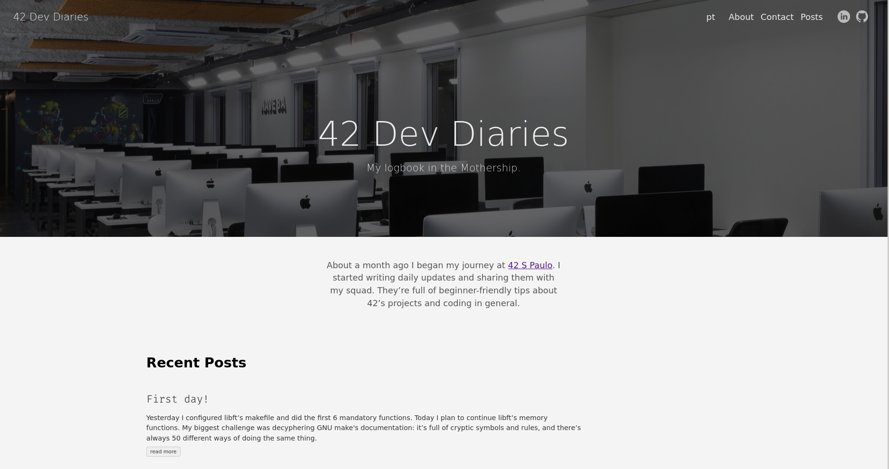

# 42 Dev Diaries

<p align="center">
  
</p>

[](https://app.netlify.com/sites/42devdiaries/deploys)

My logbook in the Mothership.

- Production: https://42devdiaries.netlify.app

## Table of Contents

- [About](#about)
- [Getting Started](#getting_started)
- [Usage](#usage)
- [Docs](docs)
- [Resources](resources)

## About <a name = "about"></a>

About a month ago I began my journey at [42 S Paulo](https://www.42sp.org.br/).
I started writing daily updates and sharing them with my squad. They're full of
beginner-friendly tips about 42's projects and coding in general.

A friend told me I should post these online for posterty's sake. I was
studying GO the other night and I came across a new static site generator
called [Hugo](https://gohugo.io/), so I thought I'd give it a shot.

## Getting Started <a name = "getting_started"></a>

### Prerequisites

All you need to get started is the latest version of Hugo in your `$PATH`.

- https://gohugo.io/getting-started/installing/

```bash
# macOS
$ brew install hugo
# Ubuntu/Debian
$ sudo apt-get install hugo
# Windows
$ choco install hugo-extended -confirm
```

### Installing

Clone the repo and start a development server:

```bash
$ git clone --recursive https://github.com/librity/ft_dev_diaries.git
$ cd ft_dev_diaries
$ hugo server -D
```

Open http://localhost:1313/ on your web browser.

## Usage <a name = "usage"></a>

Create new posts with:

```bash
$ hugo new posts/POST_NAME.md
```

## Docs <a name = "docs"></a>

Hugo:

- https://gohugo.io/getting-started/quick-start/
- https://gohugo.io/hosting-and-deployment/hosting-on-netlify/

Theme:

- https://github.com/theNewDynamic/gohugo-theme-ananke
- http://tachyons.io/docs/themes/skins/

CSS:

- http://tachyons.io/docs/

Markdown:

- https://www.markdownguide.org/basic-syntax/
- https://bookdown.org/yihui/rmarkdown-cookbook/indent-text.html
- https://riptutorial.com/markdown/example/1796/strikethrough

Misc:

- https://prettier.io/docs/en/cli1.html

TOML Formatter:

- https://taplo.tamasfe.dev/configuration/#formatting-options

## Resources <a name = "resources"></a>

Themes:

- https://themes.gohugo.io/tags/blog/
- https://themes.gohugo.io/gohugo-theme-ananke/
- https://themes.gohugo.io/anatole/
- https://themes.gohugo.io/hugo-theme-diary/
- https://themes.gohugo.io/hugo-researcher/
- https://github.com/formspree/blogophonic-hugo

Fonts:

- https://www.designyourway.net/blog/typography/fonts-similar-to-futura/
- https://fonts.google.com/specimen/Mulish?preview.text_type=custom
- https://fonts.google.com/specimen/Didact+Gothic?preview.text_type=custom
- https://fonts.google.com/specimen/Poppins?preview.text_type=custom
- https://fonts.google.com/specimen/Montserrat?preview.text_type=custom

Comments:

- https://disqus.com/
- https://www.commento.io/

Forms:

- https://formspree.io/library

Stack Overflow:

- https://stackoverflow.com/questions/17538151/how-to-make-text-take-full-width-of-its-container
- https://stackoverflow.com/questions/42043648/where-do-i-put-my-favicon-with-hugo

Misc:

- https://github.com/theNewDynamic/awesome-hugo
- https://www.grammarcheck.net/editor/
